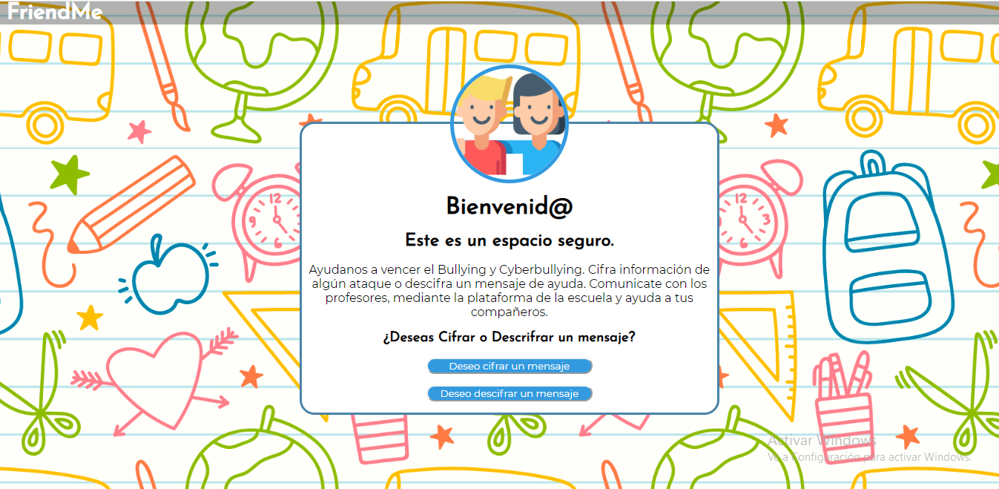
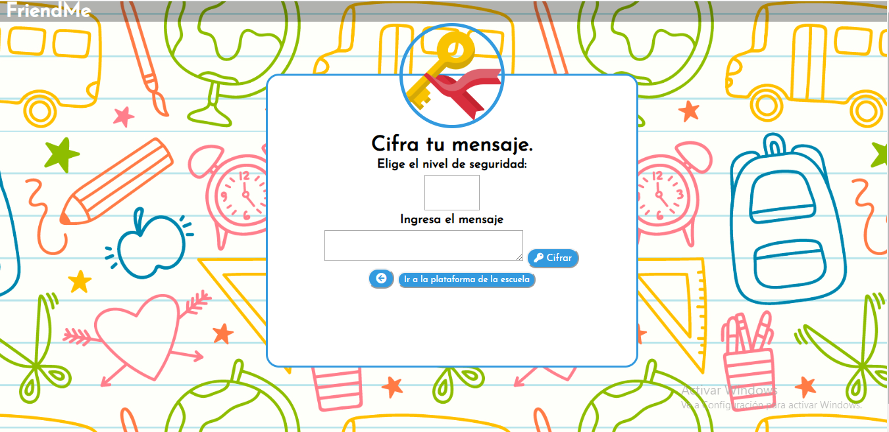
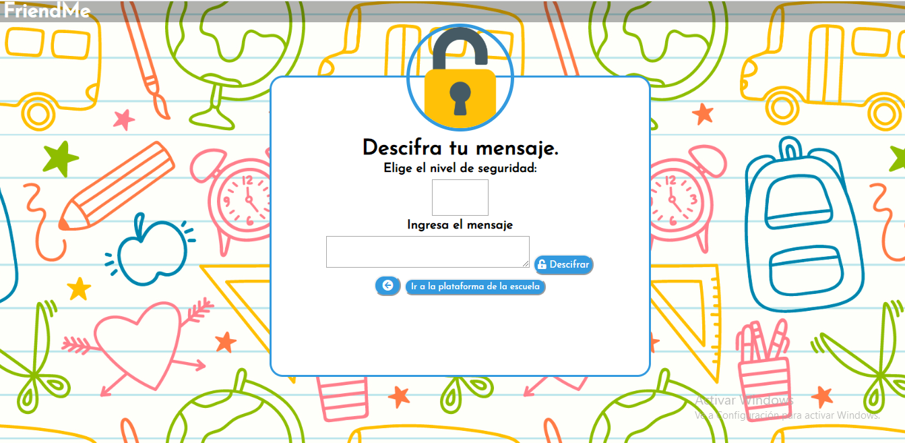
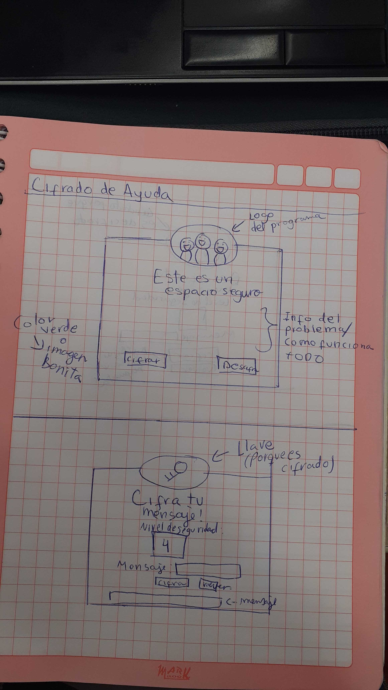
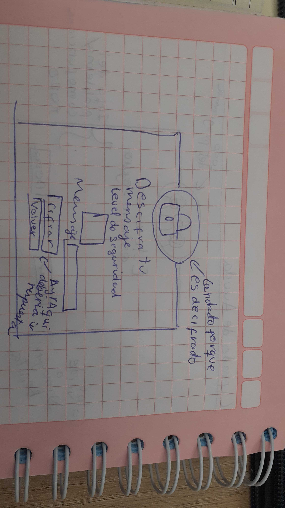
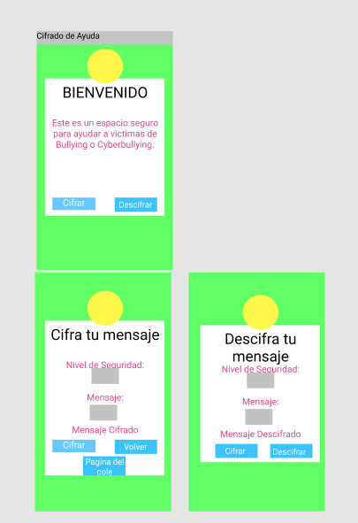

# Cifrado César
¡Bienvenido este es mi primer proyecto en la bootcamp de Laboratoria! :D <3
## Índice

* [1. Preámbulo](#1-preámbulo)
* [2. Objetivos de aprendizaje](#2-objetivos-de-aprendizaje)

***

## 1. Preámbulo

Cifrar significa codificar. El [cifrado César](https://en.wikipedia.org/wiki/Caesar_cipher)
es uno de los primeros métodos de cifrado conocidos. El emperador romano Julio
César lo usaba para enviar órdenes secretas a sus generales en los campos de
batalla.


El cifrado césar es una de las técnicas más simples para cifrar un mensaje. Es
un tipo de cifrado por sustitución, es decir que cada letra del texto original
es reemplazada por otra que se encuentra un número fijo de posiciones
(desplazamiento) más adelante en el mismo alfabeto.

Por ejemplo, si usamos un desplazamiento (_offset_) de 3 posiciones:

* La letra A se cifra como D.
* La palabra CASA se cifra como FDVD.
* Alfabeto sin cifrar: A B C D E F G H I J K L M N O P Q R S T U V W X Y Z
* Alfabeto cifrado: D E F G H I J K L M N O P Q R S T U V W X Y Z A B C

En la actualidad, todos los cifrados de sustitución simple se descifran con
mucha facilidad y, aunque en la práctica no ofrecen mucha seguridad en la
comunicación por sí mismos; el cifrado César sí puede formar parte de sistemas
más complejos de codificación, como el cifrado Vigenère, e incluso tiene
aplicación en el sistema ROT13.

## 2. Objetivos de aprendizaje

En este proyecto aprenderás a construir una aplicación web (_WebApp_) que
interactuará con el usuario final a través del navegador utilizando HTML, CSS y
JavaScript como herramientas.

Reflexiona y luego marca los objetivos que has llegado a **entender** y
**aplicar** en tu proyecto.

### UX

* [x] [Diseñar la aplicación pensando y entendiendo al usuario](https://lms.laboratoria.la/cohorts/lim-2020-01-bc-core-lim012/courses/intro-ux/01-el-proceso-de-diseno/00-el-proceso-de-diseno)
* [x] [Crear prototipos para obtener feedback e iterar](https://lms.laboratoria.la/cohorts/lim-2020-01-bc-core-lim012/courses/product-design/00-sketching/00-sketching)
* [ ] [Aplicar los principios de diseño visual](https://lms.laboratoria.la/cohorts/lim-2020-01-bc-core-lim012/courses/product-design/01-visual-design/01-visual-design-basics)

### HTML y CSS

* [x] [Uso correcto de HTML semántico](https://developer.mozilla.org/en-US/docs/Glossary/Semantics#Semantics_in_HTML)
* [x] [Uso de selectores de CSS](https://developer.mozilla.org/es/docs/Web/CSS/Selectores_CSS)
* [x] [Construir tu aplicación respetando el diseño realizado](https://lms.laboratoria.la/cohorts/lim-2020-01-bc-core-lim012/courses/css/01-css/02-boxmodel-and-display) (maquetación).

### DOM

* [x] [Uso de selectores de nodos del DOM](https://lms.laboratoria.la/cohorts/lim-2020-01-bc-core-lim012/courses/browser/02-dom/03-1-dom-methods-selection)
* [x] [Manejo de eventos del DOM](https://lms.laboratoria.la/cohorts/lim-2020-01-bc-core-lim012/courses/browser/02-dom/04-events)
* [ ] [Manipulación dinámica del DOM](https://developer.mozilla.org/es/docs/Referencia_DOM_de_Gecko/Introducci%C3%B3n)

### Javascript

* [x] [Manipulación de strings](https://lms.laboratoria.la/cohorts/lim-2020-01-bc-core-lim012/courses/javascript/06-strings/01-strings)
* [x] [Uso de condicionales](https://lms.laboratoria.la/cohorts/lim-2020-01-bc-core-lim012/courses/javascript/02-flow-control/01-conditionals-and-loops)
* [ ] [Uso de bucles](https://lms.laboratoria.la/cohorts/lim-2020-01-bc-core-lim012/courses/javascript/02-flow-control/02-loops)
* [x] [Uso de funciones](https://lms.laboratoria.la/cohorts/lim-2019-09-bc-core-lim011/courses/javascript/02-flow-control/03-functions)
* [ ] [Datos atómicos y estructurados](https://www.todojs.com/tipos-datos-javascript-es6/)
* [ ] Utilizar ES Modules (`import` | `export`).

### Testing

* [x] [Testeo de tus funciones](https://jestjs.io/docs/es-ES/getting-started)

### Git y GitHub

* [x] [Comandos de git](https://lms.laboratoria.la/cohorts/lim-2019-09-bc-core-lim011/courses/scm/01-git/04-commands)
  (`add` | `commit` | `pull` | `status` | `push`).
* [ ] [Manejo de repositorios de GitHub](https://lms.laboratoria.la/cohorts/lim-2019-09-bc-core-lim011/courses/scm/02-github/01-github)  (`clone` | `fork` | `gh-pages`).

### Buenas prácticas de desarrollo

* [ ] Organizar y dividir el código en módulos (Modularización).
* [x] Uso de identificadores descriptivos (Nomenclatura | Semántica).
* [ ] Uso de linter para seguir buenas prácticas (ESLINT).

### Scripts / Archivos

#### General

##### `README.md`

* FriendMe: Una plataforma segura para niños y adolescentes valientes que se paran y denuncian el Bullying o Cyberbullying.
* Según el MINEDU, al día, 27 niños peruanos son víctimas de violencia escolar. Tras ver esta problemática y aprovechar las herramientas tecnológicas. Se creo una appweb, donde los alumnos podran cifrar y descrifrar mensajes de ayuda en caso de Bullying. Esta appweb estara enlazada con la plataforma de la escuela, que conecta a los profesores y padres de familia.
* Imagen final de mi proyecto:
  
  
  
* Investigación UX:
  1. Los usuarios son:
      -Alumnos victima de Bullying o Cyberbullying.
      -Alumnos testigo de Bullying o Cyberbullying.
      -Profesores o autoridades de colegio, que reciben un mensaje cifrado y usan la app para descifrar el mensaje de ayuda del alumno.
  2. Yo me enfoque más en los estudiantes, debido que los profesores son como un usuario ocasional. Basada en las experiencias que pude observar en la secundaria, aquellos alumnos que sufren bullying, nunca desean hablar del tema y detestan que otras se metan en sus asuntos. Los adolescentes, sienten que el hecho de que alguien les haga Bullying, es humillante y vergonzoso, por eso callan. Y si existe un amigo que desea hablar por el, intentan por todo modo no dejar que hablen. Es por ello que el proyecto de cifrado me parecio excelente, ya que es un medio por el cual, los alumnos confienzan sus miedos, pero en un mensaje secreto.
  3. Foto de tu primer prototipo en papel:
    
    
  4. Feedback:
      -Usa una imagen en el fondo
      -Pon un boton para ir a la pagina principal, ya que el mensaje debe ser enviado ahí.
      -El boton volver debe estar abajo del mensaje Cifrado/Descifrado
      -Elige un nombre para el proyecto.(Antes solo se llamaba Cifrado de Ayuda, es que no habia nombre :c)
      -Pon el nombre del proyecto en el header.
  5. Imagen del prototipo final:
    


#### Visualmente (HTML y CSS)

Deberás maquetar de forma exacta el prototipo final que hiciste en balsamiq
utilizando HTML y CSS. En este momento elegirás los colores, tipo de fuente,
etc a usar.

A continuación describimos los archivos que utilizarás:

##### `src/index.html`

En este archivo va el contenido que se mostrará al usuario (esqueleto HTML).
Encontrarás 3 etiquetas iniciales, las cuales si deseas puedes borrar y empezar
de cero:

* `<header>`: encabezado de tu proyecto.
* `<main>`: contenido principal de tu proyecto.
* `<footer>`: pie de página de tu proyecto.

##### `src/style.css`

Este archivo debe contener las reglas de estilo. Queremos que escribas tus
propias reglas, por eso NO está permitido el uso de frameworks de CSS
(Bootstrap, materialize, etc).

#### Funcionalmente (JavaScript - pruebas unitarias)

* La lógica del proyecto debe estar implementada completamente en JavaScript.
* En este proyecto NO está permitido usar librerías o frameworks, sólo
[vanilla JavaScript](https://medium.com/laboratoria-how-to/vanillajs-vs-jquery-31e623bbd46e).
* No se debe utilizar la _pseudo-variable_ `this`.

Vas a tener 2 archivos JavaScript separando responsabilidades, a continuación
indicamos qué harás en cada archivo:

##### `src/cipher.js`

Acá escribirás las funciones necesarias para que el usuario pueda encriptar o
desencriptar el mensaje (texto).
Esta función debe ser pura e independiente del DOM.

Para esto debes implementar el **objeto `cipher`**, el cual ya se encuentra
_exportado_ en el _boilerplate_. Este objeto (`cipher`) contiene
dos métodos (`encode` y `decode`):

* **`cipher.encode(offset, string)`**: `offset` es el número de posiciones
que queremos mover a la derecha en el alfabeto y `string` el mensaje (texto)
que queremos cifrar. Esta función debe retornar un `string` con el mensaje
cifrado de acuerdo a la técnica [Cifrado césar](https://es.wikipedia.org/wiki/Cifrado_C%C3%A9sar).

* **`cipher.decode(offset, string)`**: `offset` es el número de posiciones que
    queremos mover a la izquierda en el alfabeto y `string` el mensaje
    (texto) que queremos descifrar.

  Ejemplo de uso

  ```js
  encode(33, 'ABCDE') === 'HIJKL'
  decode(33, 'HIJKL') === 'ABCDE'
  ```

##### `src/index.js`

Acá escribirás todo el código que tenga que ver con la interacción del DOM
(seleccionar, actualizar y manipular elementos del DOM y eventos).
Es decir, en este archivo deberás invocar las funciones `encode` y `decode`
según sea necesario para actualizar el resultado en la pantalla (UI).

##### `test/cipher.spec.js`

En este archivo tendrás que completar las pruebas unitarias de las funciones
`cipher.encode(offset, string)` y `cipher.decode(offset, string)`
implementadas en `cipher.js` utilizando [Jest](https://jestjs.io/es-ES/).
Tus pruebas unitarias deben dar un 70% en _coverage_ (cobertura),
_statements_ (sentencias), _functions_ (funciones) y _lines_ (líneas); y un
mínimo del 50% de _branches_ (ramas).

***
