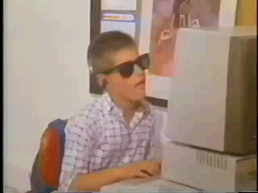
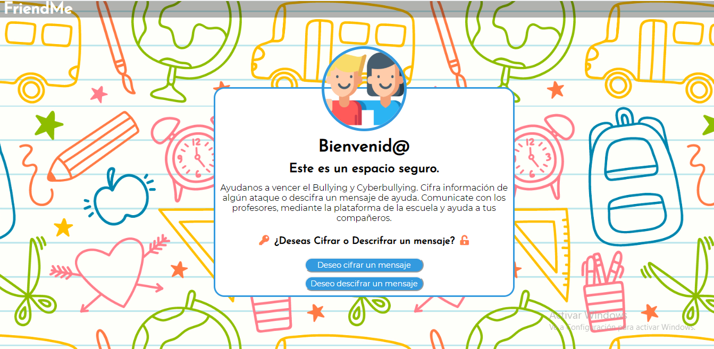

# Cifrado César
¡Bienvenido este es mi primer proyecto en la bootcamp de Laboratoria! :D <3

* Antes de empezar este proyecto, no tenía idea de que significaba cipher, había leído de criptografía en un cuento de Edgar Alan Poe y había escuchado el nombre "Cipher" en una caricatura, era un triangulito malvado que engañaba a todos con sus códigos.

* Antes de que empiezen a revisar el proyecto, dejaré un gif que me represento en el primer sprint:

* Creo que esa semana mi garabato este a nivel saiyajin!!!(hasta el día miércoles de la segunda semana) Fue ahí cuando vi la luz.

* Y ahora puedo hackear el internet. ¡¡¡¡Fin :D!!!!

* Es broma, falta mucho por aprender y estoy lista para más retos!!!

## Índice

* [1. AppWeb:FriendMe](#1-appweb:friendme)
* [2. Objetivos de aprendizaje](#2-objetivos-de-aprendizaje)

***

## 1. App Web: FriendMe

* FriendMe: Una plataforma segura para niños y adolescentes valientes que se paran y denuncian el Bullying o Cyberbullying.

* Resumen:

Según el MINEDU, al día, 27 niños peruanos son víctimas de violencia escolar. Tras ver esta problemática y aprovechar las herramientas tecnológicas. Se creo una appweb, donde los alumnos podran cifrar y descrifrar mensajes de ayuda en caso de Bullying. Esta appweb estara enlazada con la plataforma de la escuela, que conecta a los profesores y padres de familia.

* Imagen final de mi proyecto:
  
  
  

* Investigación UX:

  1. Los usuarios son:

      * Alumnos victima de Bullying o Cyberbullying.

      * Alumnos testigo de Bullying o Cyberbullying.

      * Profesores o autoridades de colegio, que reciben un mensaje cifrado y usan la app para descifrar el mensaje de ayuda del alumno.

  2. Yo me enfoque más en los estudiantes, debido que los profesores son como un usuario ocasional. Basada en las experiencias que pude observar en alumnos que sufren bullying(incluso alguien muy cercano a mi), nunca desean hablar del tema y detestan que otras se metan en sus asuntos. Los adolescentes, sienten que el hecho de que alguien les haga Bullying, es humillante y vergonzoso, por eso callan. Y si existe un amigo que desea hablar por el, intentan por todo modo no dejar que hablen. Es por ello que el proyecto de cifrado me parecio excelente, ya que es un medio por el cual, los alumnos confienzan sus miedos, pero en un mensaje secreto. Gracias a la app de la escuela, pueden enviar los mensajes cifrados en tiempo real a los profesores y así frenar casos de Bullying.

  3. Foto de tu primer prototipo en papel:
    
    
  
  4. Feedback:
      * Usa una imagen en el fondo
      * Pon un boton para ir a la pagina principal de la escuela, ya que el mensaje debe ser enviado ahí.
      * El boton volver debe estar abajo del mensaje Cifrado/Descifrado
      * Elige un nombre para el proyecto.(Antes solo se llamaba Cifrado de Ayuda, es que no habia nombre :c)
      * Pon el nombre del proyecto en el header.

  5. Imagen del prototipo final hecho en Figma:

    

    * El protipo esta hecho como app de celular, porque creí que era para dispositivos moviles.
  
  6. ¿Cómo esta AppWeb soluciona la problemática?

   * Ya que esta conectado a la app de la escuela, cada estudiante tiene su usuario con datos y cuando envian un mensaje, el profesor ya puede saber el nombre de la victima, espectador o Bully, junto con sus datos(en que grado esta, quien es su tutor y por que no esta actuando ante este caso).

   * La confianza que les genera a las victimas, al ser mensajes secretos, pueden acusar a sus Bullys mencionando nombres y grados, sin tener miedo a que alguien lea los mensajes. Esto hace más sencilla la labor del equipo de psicólogos del colegio, ya que guardan una data de cuantos casos de Bullying son hechos por el mismo alumno.
   
   
   * Es una app libre para todo estudiante, los espectadores de Bullying pueden reportar casos de todo los grados y de diferentes salones.
   
   
   * Tiene un diseño moderno y fresco que hace sentir comodo al usuario.
   
   
   * Actualmente hay muchas escuelas particulares que permiten el uso de celulares en las aulas. Todo los estudiantes tienen el app de la escuela descargada(debido a qué ahí tienen su calendario de tareas y examenes), como el app FriendMe esta enlazada con el app de la escuela. Los casos son reportados con más rápides.
   
   
   * En caso de colegios nacionales, desde el año pasado un buen grupo de colegios ha actualizado sus aulas y tienen una laptop por salon. Todo los colegios sean particulares o estatales tienen acceso rápido a la plataforma FriendMe.
   
   
   * Tras detectar casos más rápido, la intervención es inmediata y logramos generar un buen clima escolar-
   
   
   * Tanto los bullys, las victimas y espectadores reciben ayuda psicológica tras ser identificados.

   
## 2. Objetivos de aprendizaje

En este proyecto aprenderás a construir una aplicación web (_WebApp_) que
interactuará con el usuario final a través del navegador utilizando HTML, CSS y
JavaScript como herramientas.

Reflexiona y luego marca los objetivos que has llegado a **entender** y
**aplicar** en tu proyecto.

### UX

* [x] [Diseñar la aplicación pensando y entendiendo al usuario](https://lms.laboratoria.la/cohorts/lim-2020-01-bc-core-lim012/courses/intro-ux/01-el-proceso-de-diseno/00-el-proceso-de-diseno)
* [x] [Crear prototipos para obtener feedback e iterar](https://lms.laboratoria.la/cohorts/lim-2020-01-bc-core-lim012/courses/product-design/00-sketching/00-sketching)
* [ ] [Aplicar los principios de diseño visual](https://lms.laboratoria.la/cohorts/lim-2020-01-bc-core-lim012/courses/product-design/01-visual-design/01-visual-design-basics)

### HTML y CSS

* [x] [Uso correcto de HTML semántico](https://developer.mozilla.org/en-US/docs/Glossary/Semantics#Semantics_in_HTML)
* [x] [Uso de selectores de CSS](https://developer.mozilla.org/es/docs/Web/CSS/Selectores_CSS)
* [x] [Construir tu aplicación respetando el diseño realizado](https://lms.laboratoria.la/cohorts/lim-2020-01-bc-core-lim012/courses/css/01-css/02-boxmodel-and-display) (maquetación).

### DOM

* [x] [Uso de selectores de nodos del DOM](https://lms.laboratoria.la/cohorts/lim-2020-01-bc-core-lim012/courses/browser/02-dom/03-1-dom-methods-selection)
* [x] [Manejo de eventos del DOM](https://lms.laboratoria.la/cohorts/lim-2020-01-bc-core-lim012/courses/browser/02-dom/04-events)
* [ ] [Manipulación dinámica del DOM](https://developer.mozilla.org/es/docs/Referencia_DOM_de_Gecko/Introducci%C3%B3n)

### Javascript

* [x] [Manipulación de strings](https://lms.laboratoria.la/cohorts/lim-2020-01-bc-core-lim012/courses/javascript/06-strings/01-strings)
* [x] [Uso de condicionales](https://lms.laboratoria.la/cohorts/lim-2020-01-bc-core-lim012/courses/javascript/02-flow-control/01-conditionals-and-loops)
* [ ] [Uso de bucles](https://lms.laboratoria.la/cohorts/lim-2020-01-bc-core-lim012/courses/javascript/02-flow-control/02-loops)
* [x] [Uso de funciones](https://lms.laboratoria.la/cohorts/lim-2019-09-bc-core-lim011/courses/javascript/02-flow-control/03-functions)
* [ ] [Datos atómicos y estructurados](https://www.todojs.com/tipos-datos-javascript-es6/)
* [ ] Utilizar ES Modules (`import` | `export`).

### Testing

* [x] [Testeo de tus funciones](https://jestjs.io/docs/es-ES/getting-started)

### Git y GitHub

* [x] [Comandos de git](https://lms.laboratoria.la/cohorts/lim-2019-09-bc-core-lim011/courses/scm/01-git/04-commands)
  (`add` | `commit` | `pull` | `status` | `push`).
* [ ] [Manejo de repositorios de GitHub](https://lms.laboratoria.la/cohorts/lim-2019-09-bc-core-lim011/courses/scm/02-github/01-github)  (`clone` | `fork` | `gh-pages`).

### Buenas prácticas de desarrollo

* [ ] Organizar y dividir el código en módulos (Modularización).
* [x] Uso de identificadores descriptivos (Nomenclatura | Semántica).
* [ ] Uso de linter para seguir buenas prácticas (ESLINT).

***

Agradecimientos Especiales:
* A mi squad por que somos el exito!!!(No me separen de ellas porfa!!)
* A Judith, porque me enseño como entender los bucles.
* A Lulu, porque fue mi maestra del código. 
  Esta frase me recuerda a ella:"Regala un pescado a alguien hambriento y le quitaras el hambre de un día.
  Enseñale a pescar a alguien hambriento y nunca tendra hambre en toda su vida."
* A Betsy, que me enseño que mi lenght estaba mal escrito y por eso no funciona mi formula cipher!!!
* A youtube, por el grid y el flex <3
* A mi familia por ser mi motor y motivo.
* Y a mi hermanita porque ella fue mi inspiración para luchar contra esta problemática.

* Eso fue todo por hoy amigas nos vemos en la próxima! Data Lovers allá voy!!